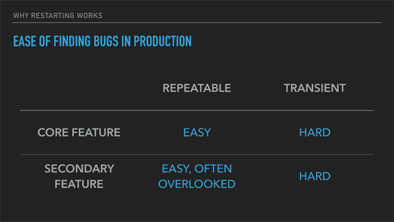

# Elixir

---

## Basic Syntax

```elixir
defmodule ModuleName do
  def hello do
    IO.puts "Hello World"
  end
end

iex> ModuleName.hello()
Hello World
```

---

## Pipe Operator

```elixir
String.replace(String.downcase(String.trim("David")), " ", "-")
```

-

```elixir
"David"
|> String.trim()
|> String.downcase()
|> String.replace(" ", "-")
```
---

## Pattern Matching - Basics

```elixir
iex> x = 1
1
iex> 1 = x
1
iex> 2 = x
** (MatchError) no match of right hand side value: 1
```

---

## Pattern Matching - Destructing

```elixir
iex> {a, b, c} = {:hello, "world", 42}
{:hello, "world", 42}
iex> a
:hello
iex> b
"world"
iex> {a, b, c} = {:hello, "world"}
** (MatchError) no match of right hand side value: {:hello, "world"}
```
---

## Pattern Matching - Destructing (continued)

```elixir
iex> {:ok, result} = {:ok, 13}
{:ok, 13}
iex> result
13

iex> {:ok, result} = {:error, :oops}
** (MatchError) no match of right hand side value: {:error, :oops}
```
---

## Pattern Matching - Function Heads

```elixir
defmodule Speak do
  def greet({:formal, first_name, last_name}) do
    IO.puts("Greetings #{first_name} #{last_name}!")
  end

  def greet({:informal, first_name, last_name}) do
    IO.puts("What's up #{first_name} #{last_name}!")
  end
end
```

```elixir
iex> Speak.greet({:formal, "David", "Pick"})
Greetings David Pick

iex> Speak.greet({:informal, "David", "Pick"})
What's up David Pick
```

---

## Structs

```elixir
defmodule User do
  defstruct [:email, :name]
end
```

-

```elixir
iex> david = %User{email: "david@brilliantmade.com", name: "David"}
iex> is_map(david)
true
iex> david.__struct__
User
```

---

## Structs - Pattern Matching

```elixir
defmodule Users do
  def send_welcome_email(%User{email: email} = user) do
    Email.welcome_email()
    |> to(email)
    |> Mailer.deliver_later()
  end

  def send_welcome_email(user) do
    {:error, :must_pass_user_struct}
  end
end
```

---

## Typespecs

```elixir
defmodule Calculator do
  @spec add(number, number) :: number
  def add(x, y), do: x + y

  @spec multiply(number, number) :: number
  def multiply(x, y), do: x * y
end
```

---

## Module Constants

```elixir
defmodule MyApp.Status do
  @service URI.parse("https://example.com")

  def status(email) do
    SomeHttpClient.get(@service)
  end
end

=======>

defmodule MyApp.Status do
  def status(email) do
    SomeHttpClient.get(%URI{host: "example.com", port: 443, scheme: "https"})
  end
end
```

---

## Processes

* All code runs inside of a process
* Isolated from each other, run concurrently, and communicate via message passing
* Store and manage state in a functional way
* Provide the basis for concurrent and the means for building distributed fault-tolerant applications
* Are very lightweight (even compared to threads in other languages), common to have tens and hundreds of thousands of them running at once

---

## Process Basics

```elixir
iex> pid = spawn(fn -> 1 + 2 end)
#PID<0.44.0>

iex> Process.alive?(pid)
false

iex> self()
#PID<0.41.0>

iex> Process.alive?(self())
true
```

---

## Sending messages

```elixir
iex> parent = self()
#PID<0.41.0>
iex> spawn(fn -> send(parent, {:hello, self()}) end)
#PID<0.48.0>
iex> receive do
...>   {:hello, pid} -> "Got hello from #{inspect pid}"
...> end
"Got hello from #PID<0.48.0>"
end
```

---

## State

```elixir
defmodule KV do
  def start_link do
    Task.start_link(fn -> loop(%{}) end)
  end

  defp loop(map) do
    receive do
      {:get, key, caller} ->
        send caller, Map.get(map, key)
        loop(map)
      {:put, key, value} ->
        loop(Map.put(map, key, value))
    end
  end
end
```

---

## State

```elixir
iex> send(pid, {:put, :hello, :world})
{:put, :hello, :world}

iex> send(pid, {:get, :hello, self()})
{:get, :hello, #PID<0.41.0>}

iex> flush()
:world
:ok
```

---

## Links

```elixir
iex> spawn(fn -> raise "oops" end)
#PID<0.58.0>

[error] Process #PID<0.58.00> raised an exception
** (RuntimeError) oops
    (stdlib) erl_eval.erl:668: :erl_eval.do_apply/6

iex> self()
#PID<0.41.0>
iex> spawn_link(fn -> raise "oops" end)

** (EXIT from #PID<0.41.0>) evaluator process exited with reason: an exception was raised:
    ** (RuntimeError) oops
        (stdlib) erl_eval.erl:668: :erl_eval.do_apply/6

[error] Process #PID<0.289.0> raised an exception
** (RuntimeError) oops
    (stdlib) erl_eval.erl:668: :erl_eval.do_apply/6
```

---

## Preemptive Scheduling

* The scheduler can stop and start any process no matter what it's doing
* Scheduler selects processes to run based on priority and how much work it's scheduled since the last time it ran

---

## Let It Crash



The Zen of Erlang (https://ferd.ca/the-zen-of-erlang.html)

---

## Supervision Trees


